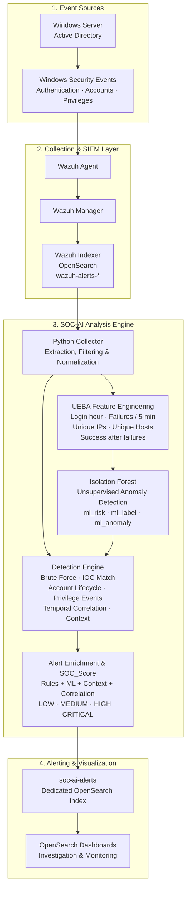

# SOC-AI — Intelligent Active Directory Threat Detection & Prioritization

> A modular cybersecurity project that enriches Windows Active Directory events collected by Wazuh, combines UEBA, rule-based detection, IOC matching and Machine Learning, then publishes prioritized alerts to OpenSearch.


> **Sanitized public demonstration repository.**  
> No production logs, real credentials, certificates, internal IP addresses, proprietary infrastructure details, or trained artifacts derived from sensitive data are included.

---

## Overview

SOC-AI is an intelligent threat-detection and alert-prioritization engine designed for Windows Active Directory environments.

Traditional SIEM platforms can generate a large number of raw security events. SOC-AI adds an analysis layer that extracts relevant Active Directory activity, builds behavioral features, applies detection rules and Machine Learning, then assigns an enriched risk score to help prioritize incidents.

The project follows a hybrid detection approach:

- Wazuh for security-event collection and normalization;
- OpenSearch for indexing, querying and visualization;
- Python for orchestration, detection logic and alert enrichment;
- UEBA features for behavioral analysis;
- Isolation Forest for unsupervised anomaly detection;
- Rules, IOC matching and temporal correlation for contextual validation;
- `SOC_Score` for final alert prioritization.

---

## Key Capabilities

- Extracts Windows and Active Directory security events from `wazuh-alerts-*`.
- Filters and normalizes authentication, account-management and privilege-related events.
- Builds UEBA features from users, hosts, IP addresses and authentication behavior.
- Detects brute-force activity through rolling authentication-failure windows.
- Detects suspicious successful logins after repeated failures.
- Detects rapid account creation and deletion scenarios.
- Detects suspicious privilege-related and privileged-group activity.
- Matches indicators of compromise across IPs, users, hosts, workstations and groups.
- Applies Isolation Forest to identify anomalous behavioral patterns.
- Enriches alerts with ML indicators, contextual information, MITRE ATT&CK mappings and a global SOC risk score.
- Sends prioritized alerts to a dedicated OpenSearch index: `soc-ai-alerts`.

---

## Architecture



---

## Detection Coverage

| Scenario | Relevant Events / Detection Logic | MITRE ATT&CK |
|---|---|---|
| Brute-force authentication | 4625, 4771, 4776 with a rolling five-minute failure window | T1110 |
| Suspicious successful login | 4624 correlated with repeated failed authentication attempts | T1078 |
| Account creation / rapid deletion | 4720 followed by 4726 in a short time window | T1136 / context-dependent |
| Privileged-group manipulation | 4728, 4729, 4732, 4733 and contextual privilege-related activity | T1098 |
| Password reset activity | 4724 | T1098 |
| Security-log clearing | 1102 | T1070.001 |
| IOC matching | IP, user, host, workstation, target account or group comparison | Context-dependent |

---

## UEBA Features

The behavioral-analysis layer builds features that help identify unusual activity:

| Feature | Description |
|---|---|
| `hour` | Time of the authentication or security event |
| `failures_5min` | Number of failed authentication attempts during a five-minute window |
| `unique_ips_user` | Number of distinct IP addresses observed for a user |
| `unique_hosts_user` | Number of distinct hosts associated with a user |
| `success_after_fail` | Successful authentication following repeated failures |

These features are used by the Isolation Forest model and contextual detection logic.

---

## Alert Enrichment

Each alert can include:

```text
soc_score
severity
ml_risk
ml_label
ml_anomaly
ctx_suspicious
mitre_attack
ioc_match
event_id
user
target_user
source_ip
host
workstation
timestamp
```

The final decision does not rely only on Machine Learning. SOC-AI combines:

```text
Rule severity
+ ML anomaly indicators
+ UEBA behavior
+ IOC matches
+ Temporal correlation
+ Contextual analysis
= SOC_Score
```

---

## Experimental Results

The project was evaluated in an academic Active Directory lab environment.

| Metric | Result |
|---|---:|
| Observation period | 7 days |
| Raw events in `wazuh-alerts-*` | 2,435 |
| Enriched alerts in `soc-ai-alerts` | 7 |
| Alert-volume reduction | ~99.7% |

These results demonstrate alert prioritization and noise reduction in the test environment. They should not be interpreted as a production benchmark or as a universal false-positive rate.

---

## Repository Structure

```text
soc-ai-active-directory/
│
├── collectors/
│   └── wazuh_ad.py              # OpenSearch connection, extraction and normalization
│
├── config/
│   ├── settings.example.py      # Safe configuration template
│   └── iocs.example.json        # Safe IOC template
│
├── core/
│   ├── context.py               # Shared SOC context
│   ├── engine.py                # Detection-engine orchestration
│   └── loader.py                # Detection-module loading
│
├── detections/
│   ├── brute_force_ad.py        # Brute-force detection
│   ├── ioc_match.py             # IOC matching
│   └── soc_ai_ml.py             # ML and contextual detection logic
│
├── features/
│   └── ad_features.py           # UEBA feature engineering
│
├── responders/
│   └── opensearch.py            # Alert publishing to OpenSearch
│
├── utils/
│   └── __init__.py
│
├── docs/
│   └── ARCHITECTURE.md
│
├── main.py                      # Application entry point
├── requirements.txt             # Python dependencies
├── .gitignore                   # Private/generated files excluded from Git
└── README.md
```

---

## Requirements

- Python 3.10 or newer recommended
- Wazuh environment collecting Windows Active Directory events
- OpenSearch / Wazuh Indexer accessible from the Python engine
- A local trained Isolation Forest model
- Valid local configuration file
- Test or lab data only

---

## Installation

### 1. Clone the repository

```bash
git clone https://github.com/Oussama-Ouenniche/soc-ai-active-directory.git
cd soc-ai-active-directory
```

### 2. Create and activate a virtual environment

#### Linux / macOS

```bash
python3 -m venv .venv
source .venv/bin/activate
```

#### Windows PowerShell

```powershell
python -m venv .venv
.venv\Scripts\Activate.ps1
```

### 3. Install dependencies

```bash
pip install -r requirements.txt
```

---

## Local Configuration

Create your local configuration files from the safe templates.

### Linux / macOS

```bash
cp config/settings.example.py config/settings.py
cp config/iocs.example.json config/iocs.json
```

### Windows PowerShell

```powershell
Copy-Item config/settings.example.py config/settings.py
Copy-Item config/iocs.example.json config/iocs.json
```

Then edit:

```text
config/settings.py
config/iocs.json
```

These local files are intentionally ignored by Git.

---

## Environment Variables

You may configure the application through environment variables instead of editing `settings.py`.

| Variable | Purpose | Example |
|---|---|---|
| `SOC_AI_WAZUH_HOST` | OpenSearch / Wazuh Indexer host | `127.0.0.1` |
| `SOC_AI_WAZUH_PORT` | OpenSearch port | `9200` |
| `SOC_AI_USERNAME` | OpenSearch username | `admin` |
| `SOC_AI_PASSWORD` | OpenSearch password | `CHANGE_ME` |
| `SOC_AI_SOURCE_INDEX` | Source Wazuh index | `wazuh-alerts-*` |
| `SOC_AI_ALERT_INDEX` | SOC-AI alert index | `soc-ai-alerts` |
| `SOC_AI_LOOKBACK_MINUTES` | Event lookback period | `1440` |
| `SOC_AI_ALERT_WINDOW_MINUTES` | Correlation window | `5` |
| `SOC_AI_MODEL_PATH` | Isolation Forest model path | `models/isolation_forest_ad.pkl` |
| `SOC_AI_ML_ANOMALY_THRESHOLD` | ML anomaly threshold | `0.60` |
| `SOC_AI_IOC_FILE` | IOC JSON file path | `config/iocs.json` |
| `SOC_AI_LOG_FILE` | Application log path | `logs/soc-ai.log` |

---

## Model Requirement

This public repository intentionally does not include the trained model file:

```text
models/isolation_forest_ad.pkl
```

To run the complete pipeline, provide your own trained Isolation Forest model locally or set another path through:

```bash
SOC_AI_MODEL_PATH
```

The model should be trained on features compatible with the UEBA feature-engineering module.

---

## Run the Application

After configuring your local environment and adding a compatible model:

```bash
python main.py
```

The application workflow is:

```text
Connect to OpenSearch
→ Extract Active Directory events
→ Normalize and clean records
→ Build UEBA features
→ Apply Isolation Forest
→ Apply rules, IOC matching and correlation
→ Compute SOC_Score
→ Publish enriched alerts to soc-ai-alerts
```

---

## Example IOC Template

The repository provides a safe template:

```json
{
  "ip": ["203.0.113.10"],
  "user": ["test_user"],
  "host": ["LAB-DC01"],
  "workstation": ["LAB-WKS01"],
  "group_name": ["Domain Admins"],
  "target_user": ["demo_admin"],
  "subject_user": ["demo_service"]
}
```

Use only laboratory or authorized threat-intelligence indicators.

---

## Key Technical Decisions

### Why Isolation Forest?

Isolation Forest was selected because security logs are commonly unlabeled. It can identify potentially unusual behavior without requiring a pre-classified dataset of malicious and legitimate events.

### Why a Hybrid Detection Approach?

Machine Learning alone can produce false positives or miss contextual attack sequences. SOC-AI therefore combines:

- deterministic detection rules;
- UEBA features;
- IOC matching;
- temporal correlation;
- contextual enrichment;
- ML anomaly indicators.

### Why a Separate Alert Index?

Raw Wazuh data remains available in:

```text
wazuh-alerts-*
```

SOC-AI stores enriched and prioritized alerts separately in:

```text
soc-ai-alerts
```

This separation helps analysts focus on high-value incidents while preserving the original event source for investigation.

---

## Limitations

This project is a proof of concept developed in a controlled lab environment.

Current limitations include:

- the model depends strongly on the quality and relevance of selected features;
- Isolation Forest does not model complete event sequences by itself;
- legitimate administrative actions may appear suspicious;
- no public production dataset is included;
- the trained model is intentionally excluded from the repository;
- the project requires a configured Wazuh/OpenSearch test environment for end-to-end execution.

---

## Future Improvements

- Add a reproducible model-training pipeline.
- Add sanitized sample events for offline demonstrations.
- Add automated unit and integration tests.
- Add Docker support for the Python SOC-AI engine.
- Add a Docker Compose lab environment for reproducible testing.
- Add additional Active Directory and endpoint telemetry sources.
- Improve sequence-based detection with LSTM or autoencoder approaches.
- Integrate automated response workflows through SOAR tooling.
- Add CI checks with GitHub Actions.

---

## Security and Responsible Publication

Before publishing or sharing a deployment, do **not** include:

- real passwords, API keys or tokens;
- certificates, private keys or SSH keys;
- internal IP addresses, domain names or host names;
- production logs or personally identifiable information;
- virtual-machine images;
- trained artifacts derived from sensitive or private data;
- screenshots exposing confidential infrastructure details.

---

## Author

**Oussama Ouenniche**  
Cybersecurity | Cloud | AI for Cybersecurity | Networking | Python & Linux

- GitHub: [@Oussama-Ouenniche](https://github.com/Oussama-Ouenniche)
- LinkedIn: www.linkedin.com/in/oussama-ouniche-9a81572a5

---

## Disclaimer

This repository is intended for educational, research and authorized laboratory use only.

Do not use this project to access, monitor or test systems without explicit authorization.